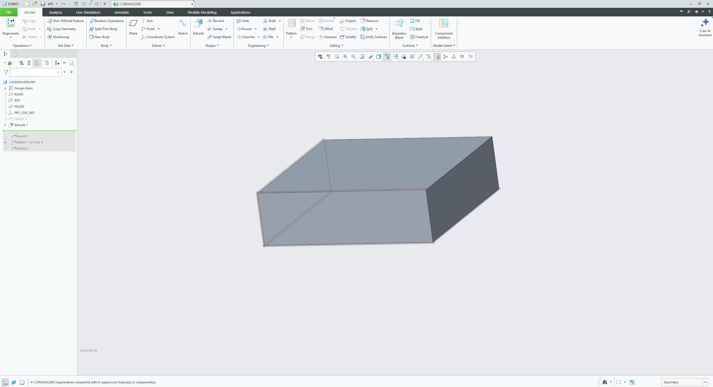
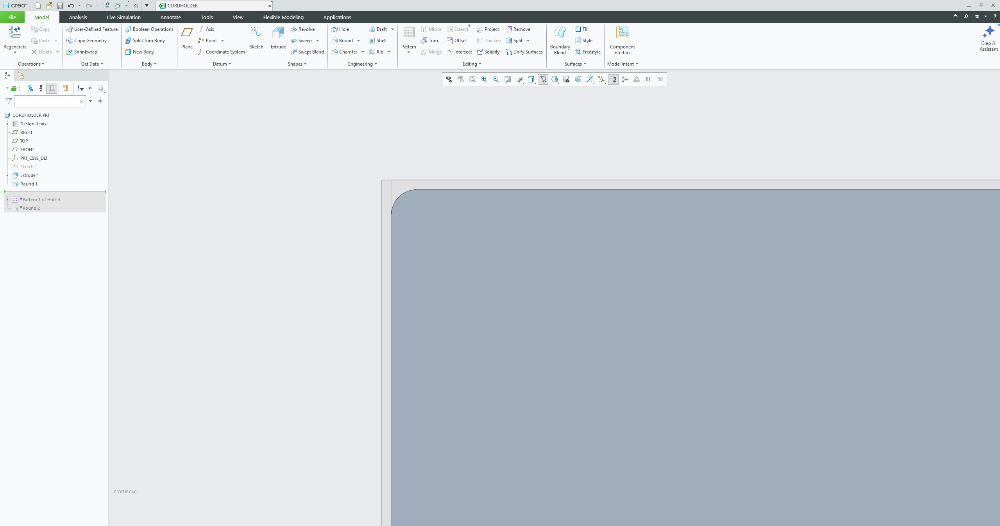
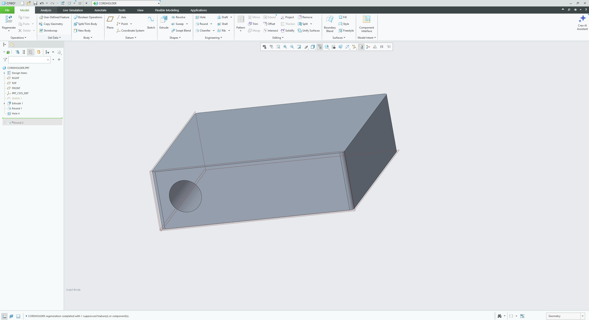
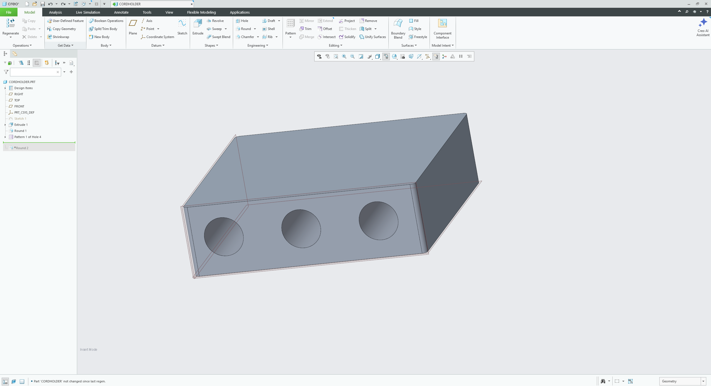
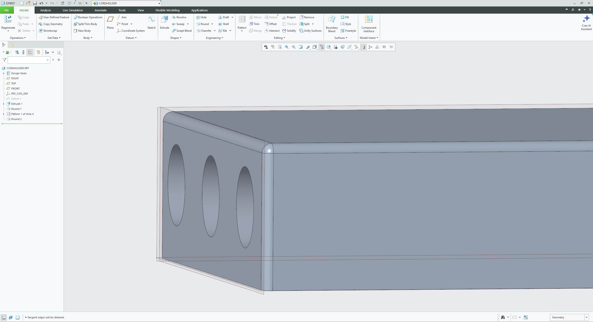
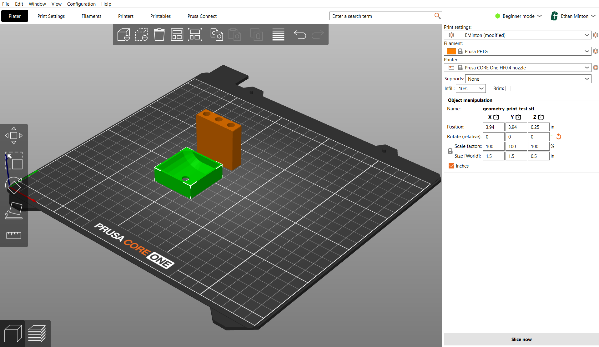
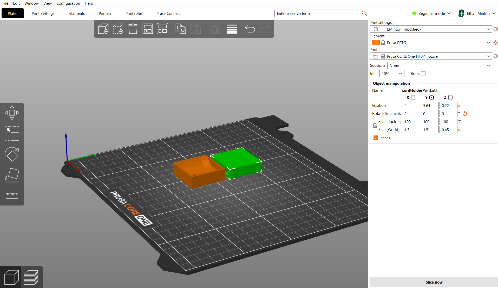
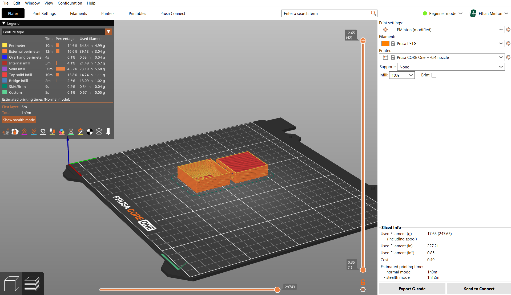
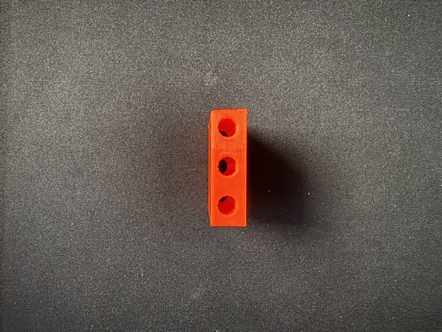
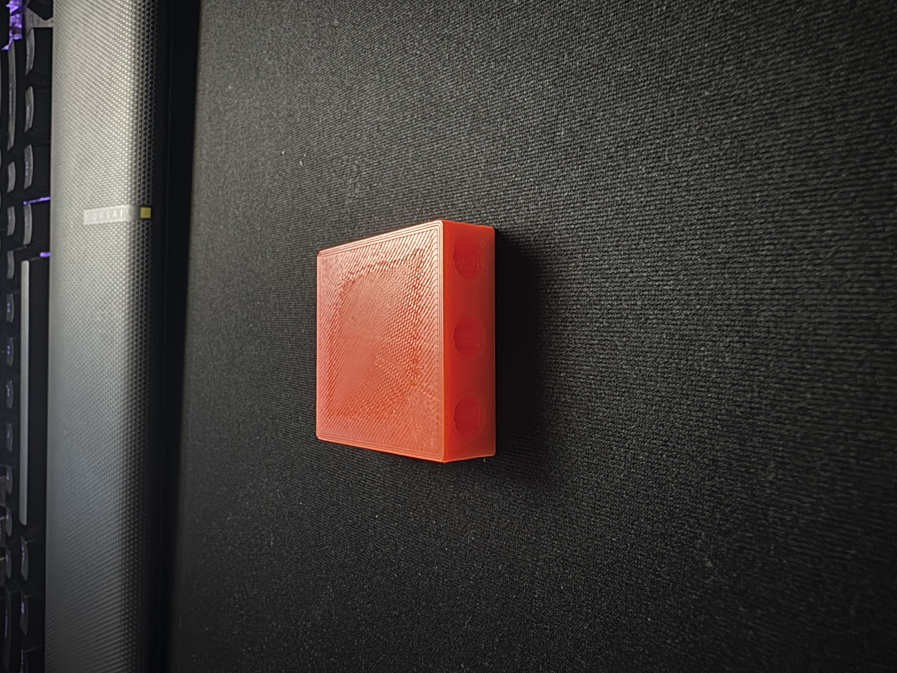

# A3 – [Topic]
## Design

My idea for this project was to create a small wire/cord holder. This was a relatively simple design based on rough measurements and designs. Eventually, this design would have more specific dimensions to actually fulfill its application. An example is [this cord holder](https://www.amazon.com/dp/B07DWV3GKC) with a lip designed to hold the cords in place. Alternatively, I would make a design similar to mine only adding some small gaps in the bottom to allow for the cables to rest under the holder. This, combined with an adhesive and smaller cord holes, could be a stick-on cable holder that does not allow for either end to pass through. 

     

My CAD design process was simple, I started with an extrusion of a rectangle matching the 1.5 in x 1.5 in parameters. The height of the extrusion did not have much a real meaning, just to save some time and material for the printing process. 

 
  

My next steps were adding the first hole and a round. The round was just added to make the body look nicer and because it makes more sense in a commercial context. The hole was designed to be roughly the size of, if not wider than, a standard cable used in electronics. I wanted it to be large enough to hold USB-A or USB-C cable. This meant making the hole diameter 0.2 in which is based on numbers I found from quickly googling. Based on the 2019 issue of the [Universal Serial Bus Type-C Cable and Connector Specification](USB.pdf), USB-C cables should range from 2 mm (0.078 in) to 6 mm (0.236 in) depending on their purpose.

  
   
  

Following the first hole, I patterned out two additional holes just for utilize the full space of the extrusion. The final step for polishing the project was rounding the corners from the top edge to the vertical faces.

  
   
  

## Research

#### Aligned Rectilinear Infill
This infill pattern is a variation of rectilinear infill defined by parallel lines within the model. Compared to rectilinear and other infills, this method is intended to save time and prevent material buildup. Other infill patterns can accumulate material at crossover points but this pattern never has to crossover. Possible issues can arise if layers of infill are perfectly parallel. In the event of parallel layers, bridging can occur.

#### Concentric Infill
Concentric infill traces the perimeter of the model, progressively drawing closer to the center. While this pattern does not increase material consumption, it does have a noticeable affect on print time. Concentric infill is useful or creating flexible products or to produce certain visual effects for transparent items.

#### Hilbert Curve Infill
This is an unorthodox infill but it still has a use. Hilbert curve infill creates rectangular labyrinth shapes inside of the model. The infill not only produces a unique look but also, due to the large cavities, can be easily filled with a resin. A disadvantage of this infill, like concentric, is its increased time needed for printing.

Different infill percentages change the density of the infill support structure. Lower infills are less dense and use less material while compromising mechanical strength. High percentage infills increase the density, weight, and strength of the item as well as the time and material cost. Different infill patterns can also affect the mechanical properties of a print. Different geometry will have more or less strength to different directions of forces and torques. Some patterns, like the gyroid infill, are also designed to save time while not completely compromising strength.

## Preprocessor and Printing
Ethan and I put our STL files into Prusa together. Both of our projects had a more obvious orientation for printing which was leaving the wider base down. In part of my design process, I wanted to hollow out the bottom of my project to cut down on material and test the printer. Dr. Fagan suggested that I orient the object with the holes vertical; with this orientation, the holes would much more support as opposed to the horizontal orientation. He also told me that I could set a small infill that would cut down on material while keeping the same integrity. Ultimately, I chose to print with a 10% honeycomb infill. Using this infill allowed me to print with the holes horizontal as there was much more internal strength.

  
   
  

We also decided to set the vertical shell perimeters to 3. This change was intended to increase the wall thickness on the project by making the printer lay down 3 outer layers.

  

   
  

When we sliced in Prusa Slicer, the project was set to take 1 hour and 9 minutes to print.

  
   

## Print
[Linked here](https://drive.google.com/drive/folders/1MEpB5sqrERa344E6ocY44eOAQrf2f366?usp=drive_link) is a video containing videos taken while our print was in process. Neither of our prints had any problems and there will be images of the final products below. 

  
   
  

## Lessons Learned
I learned a few lessons during this project. Regarding my design, in future iterations I would either design the body so that there are small gaps that cables can fit through or I would design two parts that come together. I failed account for the ends of cables being too large to fit through the holes. As it stands now, my cord holder is only usable for smaller cords like electric circuit wiring. In the process of completing this portfolio entry, I attempted to embed my print videos. I tried multiple methods like a <video> tag and an <iframe> tag but neither worked. It seems that Github Markdown may not allow those tags to completely rendered for this type of file. I also tried to drag and drop but my videos significantly exceeded the 10MB drag and drop limit.

## Resources
[Prusa Infill Patterns List](https://help.prusa3d.com/article/infill-patterns_177130)
[Github Markdown Guide[(https://docs.github.com/en/get-started/writing-on-github/getting-started-with-writing-and-formatting-on-github/basic-writing-and-formatting-syntax)
[Github Embed Video](https://bobbyhadz.com/blog/embed-video-into-github-readme-markdown#how-to-embed-a-video-into-github-readmemd-markdown)
